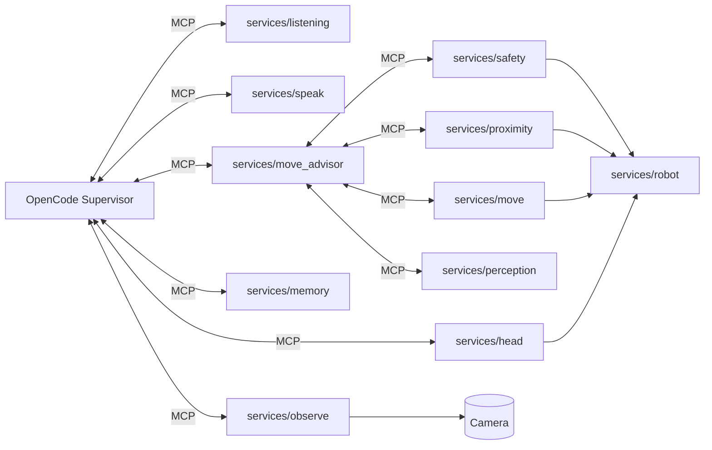
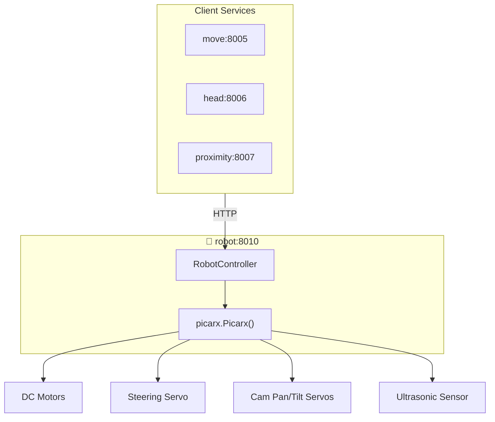
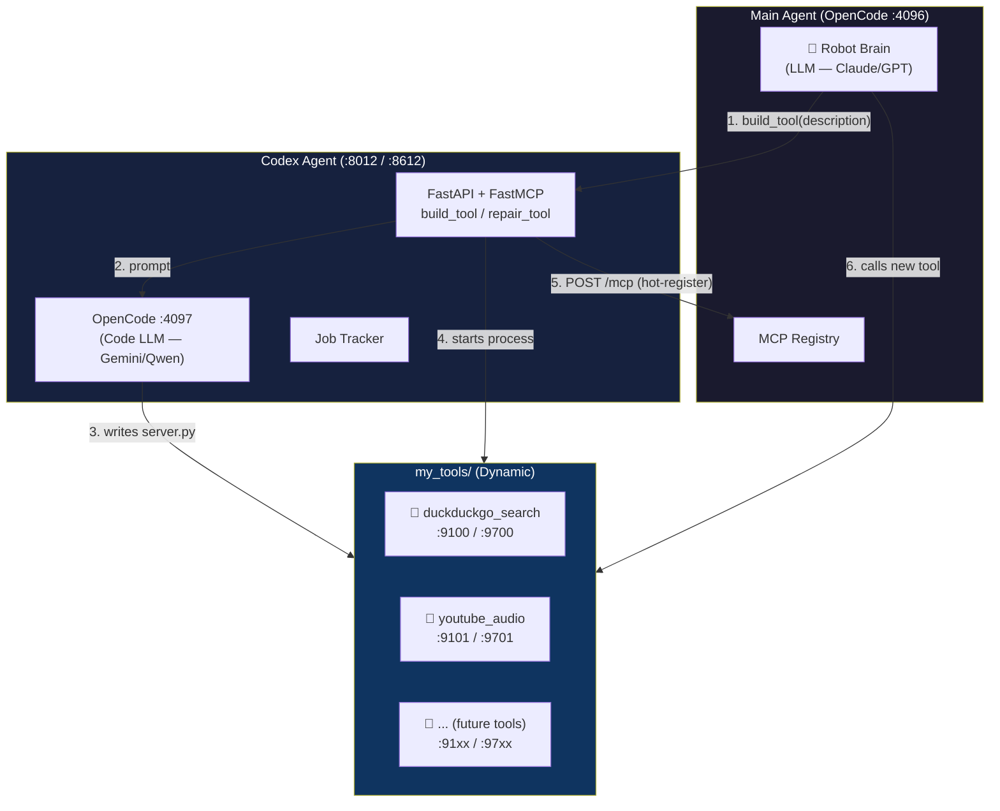
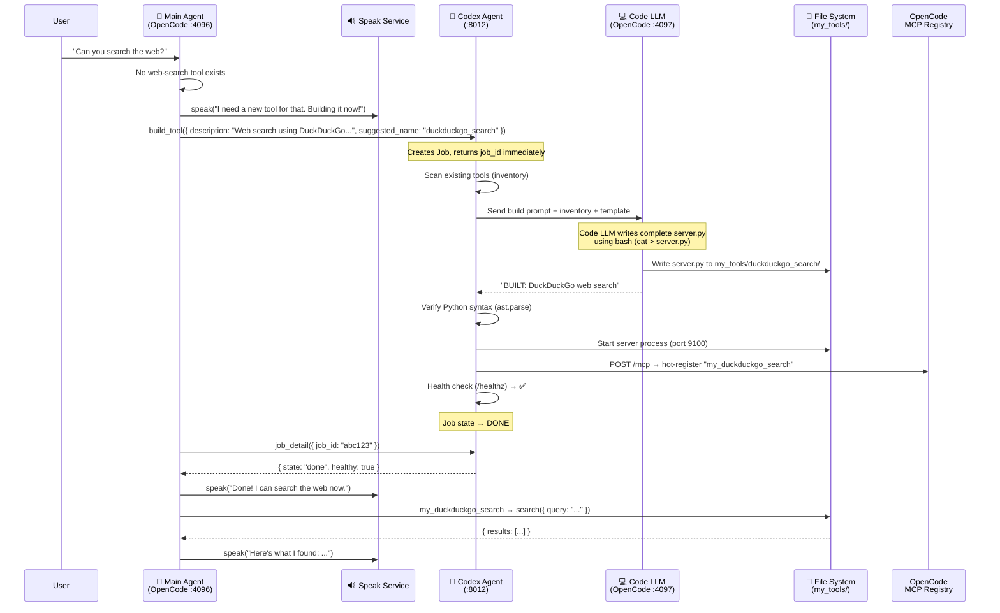
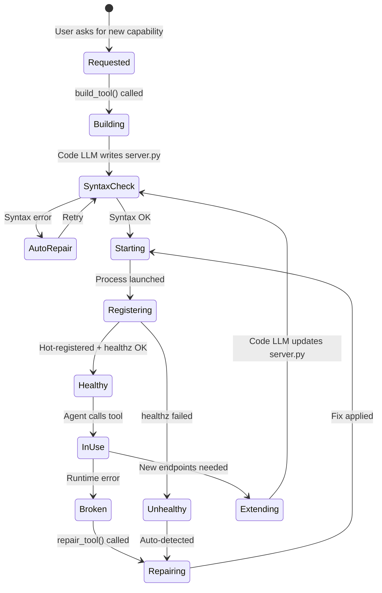
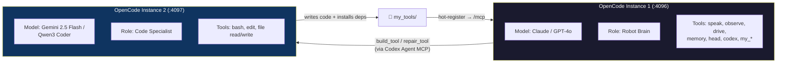

# Pi RC Bot

An autonomous robotic system for the PiCar-X platform, powered by OpenCode (LLM supervisor) and distributed MCP microservices.

> **📖 Detailed OpenCode documentation:** The [`OpenCode/README.md`](OpenCode/README.md) contains in-depth operational documentation — OpenCode HTTP API, installation, configuration, LLM provider setup (OpenAI / OpenRouter), API key management, boot sequence, and troubleshooting.

## Hardware

- **Raspberry Pi 5** (16GB RAM)
- **PiCar-X** [hardware set](https://www.sunfounder.com/products/picar-x) using Raspberry Pi

## Documentation

- [PiCar-X Documentation](https://docs.sunfounder.com/projects/picar-x-v20/en/latest/)
- [Raspberry Pi Connect](https://www.raspberrypi.com/software/connect/) — Remote desktop access via browser

---

## Setup Instructions

### Step 1: Install PiCar-X Modules
Follow the [official installation guide](https://docs.sunfounder.com/projects/picar-x-v20/en/latest/python/python_start/install_all_modules.html) to install all PiCar-X modules.

**Note:** Currently requires installation in the global Python environment to access the `robot_hat` module.

### Step 2: Install System Dependencies
```bash
sudo pip3 install -r requirements.txt --break-system-packages
```

### Step 3: Install uv Package Manager
Follow the [uv installation guide](https://docs.astral.sh/uv/getting-started/installation/)

### Step 4: Set Up Virtual Environment
```bash
uv venv .venv --python 3.12
```

### Step 5: Activate Virtual Environment
```bash
source .venv/bin/activate
```

### Step 6: Sync Dependencies
```bash
uv sync
```

### Step 7: Configure Environment
```bash
cp .env.example .env
# Edit .env and add your OPENAI_API_KEY
```

---

## Autostart on Linux boot (systemd)

This project ships systemd *user* units. Use the helper scripts to enable/disable autostart.

Three systemd units are installed:
- `pi_rc_brain_services.service` — brain cluster (listening, speak, observe, memory)
- `pi_rc_move_services.service` — move cluster (robot, head, move, proximity, perception, safety, move_advisor)
- `pi_rc_opencode.service` — OpenCode supervisor

### Install (enable autostart)

```bash
cd ~/Desktop/pi_rc_bot
bash ./scripts/install.sh
```

If you want it to start on boot even without GUI/login, enable lingering:

```bash
sudo loginctl enable-linger $USER
```

### Uninstall (disable autostart)

```bash
cd ~/Desktop/pi_rc_bot
bash ./scripts/uninstall.sh
```

### Status / Logs

```bash
systemctl --user status pi_rc_brain_services.service pi_rc_move_services.service pi_rc_opencode.service
journalctl --user -u pi_rc_brain_services.service -u pi_rc_move_services.service -u pi_rc_opencode.service -f
```

### Network wait (optional)

On boot, the services can start before Wi‑Fi/DNS is ready. The network wait prevents that race-condition.

Environment variables:

- `NETWORK_TIMEOUT_SECONDS` (default: `120`)
- `REQUIRE_INTERNET` (`0`/`1`, default: `0`)
- `PING_HOST` (default: `1.1.1.1`)

---

## Architecture

### Runtime Topology

The system runs two parallel clusters of services plus the OpenCode supervisor as brain:


```mermaid
flowchart LR
    OC[OpenCode Supervisor] <-- MCP --> L[services/listening]
    OC <-- MCP --> S[services/speak]
    OC <-- MCP --> O[services/observe]
    OC <-- MCP --> MEM[services/memory]
    OC <-- MCP --> MA[services/move_advisor]
    OC <-- MCP --> H[services/head]

    MA <-- MCP --> SA[services/safety]
    MA <-- MCP --> PX[services/proximity]
    MA <-- MCP --> PC[services/perception]
    MA <-- MCP --> MV[services/move]

    SA --> R[services/robot]
    PX --> R
    MV --> R
    H --> R
    O --> CAM[(Camera)]
```

### Clusters

| Cluster | Services | Started by |
|---------|----------|------------|
| **Brain** | listening, speak, observe, memory | `services/brain.sh` |
| **Move** | robot, head, move, proximity, perception, safety, move_advisor | `services/move_cluster.sh` |
| **Supervisor** | OpenCode (LLM agent loop) | `OpenCode/main.py` |

### Design Philosophy

The OpenCode supervisor communicates with all services exclusively via **MCP over HTTP**. There is zero code-level coupling — the supervisor and services are fully independent processes.

Motion-related actions are delegated through `services/move_advisor` (the "move cluster" entry point), which reduces sequential tool-calls and enables true parallelism.

---

## Project Structure

```
pi_rc_bot/
├── OpenCode/           # LLM supervisor (brain)
│   ├── main.py         # Entry point (sound detection → think → act)
│   ├── config.yaml     # Supervisor config (thresholds, MCP URLs)
│   ├── opencode.json   # OpenCode agent config (model, persona)
│   ├── AGENTS.md       # System prompt
│   ├── src/            # Supervisor library
│   ├── codex_agent/    # Self-repair sub-agent
│   └── my_tools/       # Agent-created MCP tools
├── services/           # MCP microservices (Python + FastAPI + FastMCP)
│   ├── brain.sh        # Start brain cluster
│   ├── move_cluster.sh # Start move cluster
│   ├── main.sh         # Start all services
│   ├── kill_all.sh     # Stop all services
│   ├── config.yaml     # Global services config
│   ├── systemd/        # Systemd unit templates
│   ├── listening/      # STT (OpenAI Whisper / Vosk)
│   ├── speak/          # TTS (OpenAI / Piper / pico2wave)
│   ├── observe/        # Vision (GPT-4o)
│   ├── memory/         # Vector memory (OpenAI embeddings)
│   ├── move/           # Drive control
│   ├── head/           # Pan/tilt control
│   ├── proximity/      # Ultrasonic distance
│   ├── perception/     # Face/people detection (OpenCV)
│   ├── safety/         # Safe motion guard
│   ├── move_advisor/   # Move cluster entry point
│   └── robot/          # PiCar-X GPIO owner
├── scripts/            # Install/deploy scripts
│   ├── install.sh      # Enable autostart (systemd)
│   └── uninstall.sh    # Disable autostart
├── .env                # API keys (not in git)
├── .env.example        # Template for .env
├── pyproject.toml      # Python dependencies (uv)
├── requirements.txt    # System-level pip dependencies
└── README.md
```

---

## Service Architecture

All services expose both **REST API** and **MCP endpoints** via FastAPI + FastMCP.

### Robot Service (Hardware Owner)

The **robot** service is the single owner of PiCar-X GPIO. All motion/head/sensor services proxy to it.


```mermaid
flowchart TB
    subgraph ROBOT_SVC["🔧 robot:8010"]
        RC["RobotController"]
        PX["picarx.Picarx()"]
    end

    subgraph CLIENTS["Client Services"]
        MOVE["move:8005"]
        HEAD["head:8006"]
        PROX["proximity:8007"]
    end

    CLIENTS -->|HTTP| RC
    RC --> PX
    PX --> MOTORS["DC Motors"]
    PX --> SERVO["Steering Servo"]
    PX --> CAMS["Cam Pan/Tilt Servos"]
    PX --> ULTRA["Ultrasonic Sensor"]
```

### Port Summary

| Service | HTTP Port | MCP Port | Description |
|---------|-----------|----------|-------------|
| robot | 8010 | 8610 | GPIO hardware owner |
| speak | 8001 | 8601 | Text-to-speech |
| listening | 8002 | 8602 | Speech-to-text |
| observe | 8003 | 8603 | Vision + VLM |
| memory | 8004 | 8604 | Vector memory store |
| move | 8005 | 8605 | Drive control |
| head | 8006 | 8606 | Pan/tilt control |
| proximity | 8007 | 8607 | Ultrasonic distance |
| perception | 8008 | 8608 | Face/people detection |
| safety | 8009 | 8609 | Safe motion guard |
| move_advisor | 8011 | 8611 | Move cluster entry point |

### MCP Tools per Service

| Service | MCP Tools |
|---------|-----------|
| **listening** | `listen` |
| **speak** | `speak`, `stop`, `status` |
| **observe** | `observe`, `observe_direction` |
| **memory** | `store_memory`, `get_top_n_memory` |
| **move** | `drive`, `stop`, `status` |
| **head** | `set_angles`, `center`, `scan`, `status` |
| **proximity** | `distance_cm`, `is_obstacle`, `status` |
| **safety** | `check`, `estop_on`, `estop_off`, `guarded_drive`, `stop` |
| **perception** | `detect`, `status` |
| **move_advisor** | `execute_action`, `job_status`, `job_cancel`, `healthz_healthz_get` |

---

## External AI/ML Models

| Operation | Model | Service |
|-----------|-------|---------|
| Vision understanding | gpt-4o | observe |
| Speech-to-text | gpt-4o-mini-transcribe (Whisper) | listening |
| Text-to-speech | gpt-4o-mini-tts | speak |
| Memory embeddings | text-embedding-3-large | memory |
| Face detection | OpenCV Haar cascades (local) | perception |

### Environment Variables

All OpenAI calls require an API key. Set in `.env`:

```bash
OPENAI_API_KEY=sk-...
# Optional: custom endpoint
OPENAI_BASE_URL=https://your-endpoint/v1
```

---

## Dynamic Tool Creation — Self-Extending Agent via Codex Agent

One of the most powerful capabilities enabled by [OpenCode](https://opencode.ai) is the ability to give the main robot agent access to a **dedicated coding agent** (the Codex Agent). This means the robot can **create entirely new MCP tool servers on the fly** — at runtime, on request, without any human developer involvement.

OpenCode exposes a **headless HTTP API** (`opencode serve`) that turns any LLM into a fully autonomous coding agent with file editing, terminal access, and tool-use capabilities. The Codex Agent runs its **own, separate OpenCode instance** (port 4097) backed by a strong code model. For best results, we recommend using **gpt 4.1** as the main agent model (for reasoning and tool use with moderate response speed), and a strong code model (e.g., **Claude Sonnet 4.5** because speed does not matter here) for the Codex Agent. This gives the system the same power as a human developer sitting at a terminal: it can write files, install packages, and verify syntax — all autonomously.

Because OpenCode also supports **hot-registration of MCP servers** via its `/mcp` HTTP endpoint, newly created tools can be injected into the main agent's tool palette at runtime, without restarting anything.

### Why OpenCode Makes This Possible

OpenCode exposes a **headless HTTP API** (`opencode serve`) that turns any LLM into a fully autonomous coding agent with file editing, terminal access, and tool-use capabilities. The Codex Agent runs its **own, separate OpenCode instance** (port 4097) backed by a strong code model (e.g., Gemini 2.5 Flash, Qwen3 Coder). This gives it the same power as a human developer sitting at a terminal: it can write files, install packages, and verify syntax — all autonomously.

Because OpenCode also supports **hot-registration of MCP servers** via its `/mcp` HTTP endpoint, newly created tools can be injected into the main agent's tool palette at runtime, without restarting anything.

### Architecture Overview


```mermaid
flowchart TB
    subgraph MAIN["Main Agent (OpenCode :4096)"]
        BRAIN["🧠 Robot Brain<br/>(LLM — Claude/GPT)"]
        MCP_REG["MCP Registry"]
    end

    subgraph CODEX["Codex Agent (:8012 / :8612)"]
        CODEX_API["FastAPI + FastMCP<br/>build_tool / repair_tool"]
        CODEX_OC["OpenCode :4097<br/>(Code LLM — Gemini/Qwen)"]
        TRACKER["Job Tracker"]
    end

    subgraph MY_TOOLS["my_tools/ (Dynamic)"]
        T1["🔧 duckduckgo_search<br/>:9100 / :9700"]
        T2["🔧 youtube_audio<br/>:9101 / :9701"]
        TN["🔧 ... (future tools)<br/>:91xx / :97xx"]
    end

    BRAIN -- "1. build_tool(description)" --> CODEX_API
    CODEX_API -- "2. prompt" --> CODEX_OC
    CODEX_OC -- "3. writes server.py" --> MY_TOOLS
    CODEX_API -- "4. starts process" --> MY_TOOLS
    CODEX_API -- "5. POST /mcp (hot-register)" --> MCP_REG
    BRAIN -- "6. calls new tool" --> MY_TOOLS

    style MAIN fill:#1a1a2e,color:#fff
    style CODEX fill:#16213e,color:#fff
    style MY_TOOLS fill:#0f3460,color:#fff
```

### End-to-End Flow: Building a New Tool

The following sequence shows exactly what happens when a user says *"Can you search the web for me?"* and the robot has no web-search tool yet:


```mermaid
sequenceDiagram
    participant User
    participant Brain as 🧠 Main Agent<br/>(OpenCode :4096)
    participant Speak as 🔊 Speak Service
    participant Codex as 🔧 Codex Agent<br/>(:8012)
    participant CodeAI as 💻 Code LLM<br/>(OpenCode :4097)
    participant FS as 📁 File System<br/>(my_tools/)
    participant OC as OpenCode<br/>MCP Registry

    User->>Brain: "Can you search the web?"
    Brain->>Brain: No web-search tool exists

    Brain->>Speak: speak("I need a new tool for that. Building it now!")
    Brain->>Codex: build_tool({ description: "Web search using DuckDuckGo...", suggested_name: "duckduckgo_search" })

    Note over Codex: Creates Job, returns job_id immediately

    Codex->>Codex: Scan existing tools (inventory)
    Codex->>CodeAI: Send build prompt + inventory + template

    Note over CodeAI: Code LLM writes complete server.py<br/>using bash (cat > server.py)

    CodeAI->>FS: Write server.py to my_tools/duckduckgo_search/
    CodeAI-->>Codex: "BUILT: DuckDuckGo web search"

    Codex->>Codex: Verify Python syntax (ast.parse)
    Codex->>FS: Start server process (port 9100)
    Codex->>OC: POST /mcp → hot-register "my_duckduckgo_search"
    Codex->>Codex: Health check (/healthz) → ✅

    Note over Codex: Job state → DONE

    Brain->>Codex: job_detail({ job_id: "abc123" })
    Codex-->>Brain: { state: "done", healthy: true }

    Brain->>Speak: speak("Done! I can search the web now.")
    Brain->>FS: my_duckduckgo_search → search({ query: "..." })
    FS-->>Brain: { results: [...] }
    Brain->>Speak: speak("Here's what I found: ...")
```

### How Each Step Works Internally

#### Step 1 — Build Request

The main agent calls `robot_codex` → `build_tool` with a plain-text description. The Codex Agent creates an async **Job** (tracked by `JobTracker`) and returns a `job_id` immediately. A background thread starts the actual build.

#### Step 2 — Inventory Scan

Before writing any code, the `BuildWorker` scans `my_tools/` via `ToolInventory.build_inventory_for_ai()`. This produces a human-readable summary of all existing tools — their names, ports, endpoints, and source previews — so the Code LLM can decide:

| Decision | When |
|----------|------|
| `EXISTS` | An existing tool already covers the capability |
| `EXTENDING` | An existing tool is close — just add new endpoints |
| `REWRITING` | An existing tool needs fundamental redesign |
| `BUILT` | No match — build from scratch |

#### Step 3 — Code Generation

The `CodexClient` sends a detailed prompt (via `build_prompt()`) to the dedicated OpenCode instance on port 4097. This prompt includes:
- The requested capability description
- The full tool inventory
- A mandatory code template (FastAPI + FastMCP + dual-uvicorn bootstrap)
- Strict rules (Python only, `uv add` for packages, `httpx` for HTTP, Pydantic models with descriptions)

The Code LLM writes a complete, working `server.py` using bash `cat` commands — not stubs.

#### Step 4 — Verification & Deployment

After the Code LLM finishes:

1. **Syntax verification** — `ast.parse(server.py)` catches any Python syntax errors
2. **Auto-repair** — If syntax fails, a repair prompt is sent for a second attempt
3. **Process launch** — The server is started as a subprocess via `ToolInventory.restart()`
4. **Hot-registration** — `ToolInventory.re_register()` calls `POST /mcp` on the main OpenCode instance (port 4096) to inject the new tool into the MCP registry
5. **Health check** — A `GET /healthz` call confirms the server is alive and responding

#### Step 5 — Immediate Availability

The new tool is now a first-class MCP tool in the main agent's palette, prefixed with `my_` (e.g., `my_duckduckgo_search`). The agent can call it in the same conversation turn.

### Self-Repair: Fixing Broken Tools

The Codex Agent doesn't just build — it also **repairs**. The main supervisor periodically health-checks all `my_tools/` servers. When a tool is broken:


```mermaid
flowchart LR
    HC["Health Check<br/>(every 5 min)"] -- "unhealthy" --> BRAIN["🧠 Main Agent"]
    BRAIN -- "repair_tool(description)" --> CODEX["🔧 Codex Agent"]
    CODEX -- "reads source + logs" --> DIAG["Diagnose<br/>(error patterns)"]
    DIAG -- "repair prompt" --> AI["💻 Code LLM"]
    AI -- "writes fix" --> FS["📁 server.py"]
    FS -- "restart + re-register" --> LIVE["✅ Tool Healthy"]
```

The `RepairWorker`:
1. Auto-detects which tool is broken by matching tool names in the description or scanning for unhealthy servers
2. Reads the full source code, error logs, and server status via `ToolInventory.read()`
3. Sends everything to the Code LLM with a `repair_prompt()`
4. Verifies the fix was applied (SHA-256 hash comparison of `server.py` before/after)
5. Restarts and re-registers the repaired tool

### Tool Lifecycle


```mermaid
stateDiagram-v2
    [*] --> Requested: User asks for new capability
    Requested --> Building: build_tool() called
    Building --> SyntaxCheck: Code LLM writes server.py
    SyntaxCheck --> AutoRepair: Syntax error
    AutoRepair --> SyntaxCheck: Retry
    SyntaxCheck --> Starting: Syntax OK
    Starting --> Registering: Process launched
    Registering --> Healthy: Hot-registered + healthz OK
    Registering --> Unhealthy: healthz failed
    Healthy --> InUse: Agent calls tool
    InUse --> Broken: Runtime error
    Broken --> Repairing: repair_tool() called
    Repairing --> Starting: Fix applied
    Unhealthy --> Repairing: Auto-detected
    InUse --> Extending: New endpoints needed
    Extending --> SyntaxCheck: Code LLM updates server.py
```

### Port Allocation

Dynamic tools use auto-assigned ports starting from **9100**, with MCP ports at **+600**:

| Tool | API Port | MCP Port | Status |
|------|----------|----------|--------|
| duckduckgo_search | 9100 | 9700 | Built by Codex Agent |
| youtube_audio_search_loop | 9101 | 9701 | Built by Codex Agent |
| *(next tool)* | 9102 | 9702 | *(auto-assigned)* |

Each tool's port is persisted in `my_tools/<name>/port.txt` to survive restarts.

### Two-Level OpenCode Architecture

A key architectural insight is the **two independent OpenCode instances**:


```mermaid
flowchart LR
    subgraph OC1["OpenCode Instance 1 (:4096)"]
        direction TB
        M1["Model: Claude / GPT-4o"]
        R1["Role: Robot Brain"]
        T1["Tools: speak, observe, drive,<br/>memory, head, codex, my_*"]
    end

    subgraph OC2["OpenCode Instance 2 (:4097)"]
        direction TB
        M2["Model: Gemini 2.5 Flash /<br/>Qwen3 Coder"]
        R2["Role: Code Specialist"]
        T2["Tools: bash, edit, file read/write"]
    end

    OC1 -- "build_tool / repair_tool<br/>(via Codex Agent MCP)" --> OC2
    OC2 -- "writes code + installs deps" --> FS["📁 my_tools/"]
    FS -- "hot-register → /mcp" --> OC1

    style OC1 fill:#1a1a2e,color:#fff
    style OC2 fill:#0f3460,color:#fff
```

| | Main Agent (OC1) | Codex Agent (OC2) |
|---|---|---|
| **Port** | 4096 | 4097 |
| **Model** | Claude Sonnet / GPT-4o | Gemini 2.5 Flash / Qwen3 Coder |
| **Role** | Robot brain — perception, speech, motion, planning | Code specialist — write, debug, deploy MCP servers |
| **MCP Tools** | 10+ service tools + dynamic `my_*` tools | bash, file edit (OpenCode built-in tools) |
| **Isolation** | Never writes code | Never drives the robot |

This separation ensures the robot brain stays focused on its mission (exploring, interacting, executing plans) while code tasks are handled by a specialist model optimized for programming.

### Example: Tools Built at Runtime

The robot has already used this system to create tools on user request:

| Tool | Description | How It Was Created |
|------|-------------|--------------------|
| `duckduckgo_search` | Web search via DuckDuckGo API | User asked "Can you search the web?" |
| `youtube_audio_search_loop` | Search and play YouTube audio | User asked "Can you play music from YouTube?" |

Each tool is a fully self-contained FastAPI + FastMCP server with health checks, Pydantic models, and proper error handling — all written autonomously by the Codex Agent.

---

## Development

### OpenCode supervisor (`OpenCode/`)
```bash
cd OpenCode
uv run python main.py
```

### Services (`services/`)
```bash
# Start all services
cd services
bash main.sh

# Or start individual clusters
bash brain.sh
bash move_cluster.sh
```

### Installing new Python packages
```bash
# For OpenCode / root project:
uv add <package>

# For services (system Python):
pip3 install <package>
# Then update requirements.txt
```
