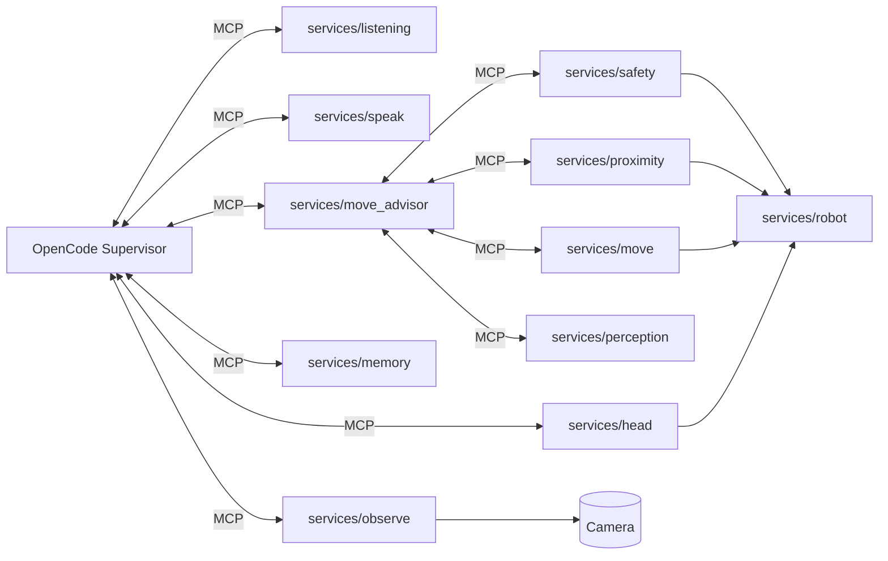
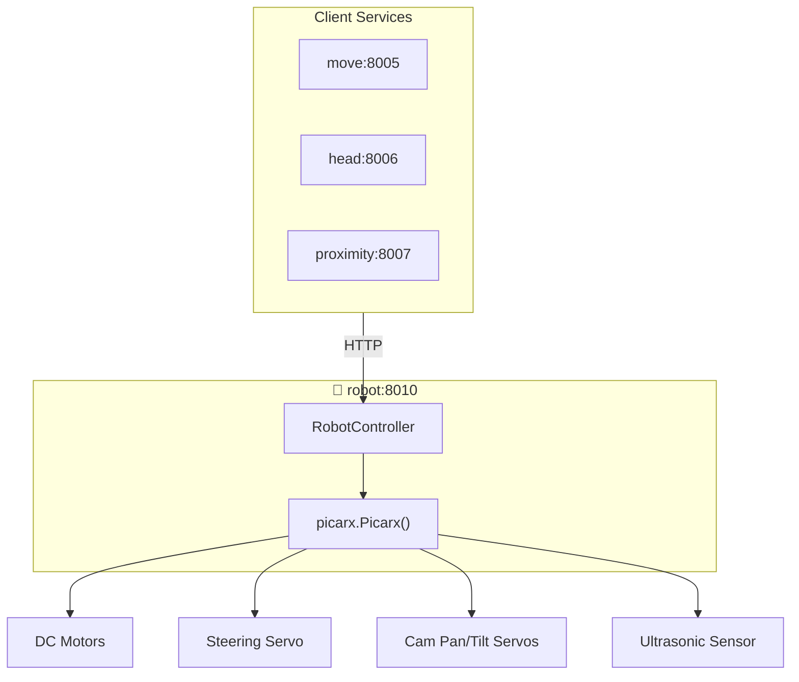

# Pi RC Bot

An autonomous robotic system for the PiCar-X platform, powered by OpenCode (LLM supervisor) and distributed MCP microservices.

## Hardware

- **Raspberry Pi 5** (16GB RAM)
- **PiCar-X** [hardware set](https://www.sunfounder.com/products/picar-x) using Raspberry Pi

## Documentation

- [PiCar-X Documentation](https://docs.sunfounder.com/projects/picar-x-v20/en/latest/)
- [Raspberry Pi Connect](https://www.raspberrypi.com/software/connect/) — Remote desktop access via browser

---

## Setup Instructions

### Step 1: Install PiCar-X Modules
Follow the [official installation guide](https://docs.sunfounder.com/projects/picar-x-v20/en/latest/python/python_start/install_all_modules.html) to install all PiCar-X modules.

**Note:** Currently requires installation in the global Python environment to access the `robot_hat` module.

### Step 2: Install System Dependencies
```bash
sudo pip3 install -r requirements.txt --break-system-packages
```

### Step 3: Install uv Package Manager
Follow the [uv installation guide](https://docs.astral.sh/uv/getting-started/installation/)

### Step 4: Set Up Virtual Environment
```bash
uv venv .venv --python 3.12
```

### Step 5: Activate Virtual Environment
```bash
source .venv/bin/activate
```

### Step 6: Sync Dependencies
```bash
uv sync
```

### Step 7: Configure Environment
```bash
cp .env.example .env
# Edit .env and add your OPENAI_API_KEY
```

---

## Autostart on Linux boot (systemd)

This project ships systemd *user* units. Use the helper scripts to enable/disable autostart.

Three systemd units are installed:
- `pi_rc_brain_services.service` — brain cluster (listening, speak, observe, memory)
- `pi_rc_move_services.service` — move cluster (robot, head, move, proximity, perception, safety, move_advisor)
- `pi_rc_opencode.service` — OpenCode supervisor

### Install (enable autostart)

```bash
cd ~/Desktop/pi_rc_bot
bash ./scripts/install.sh
```

If you want it to start on boot even without GUI/login, enable lingering:

```bash
sudo loginctl enable-linger $USER
```

### Uninstall (disable autostart)

```bash
cd ~/Desktop/pi_rc_bot
bash ./scripts/uninstall.sh
```

### Status / Logs

```bash
systemctl --user status pi_rc_brain_services.service pi_rc_move_services.service pi_rc_opencode.service
journalctl --user -u pi_rc_brain_services.service -u pi_rc_move_services.service -u pi_rc_opencode.service -f
```

### Network wait (optional)

On boot, the services can start before Wi‑Fi/DNS is ready. The network wait prevents that race-condition.

Environment variables:

- `NETWORK_TIMEOUT_SECONDS` (default: `120`)
- `REQUIRE_INTERNET` (`0`/`1`, default: `0`)
- `PING_HOST` (default: `1.1.1.1`)

---

## Architecture

### Runtime Topology

The system runs two parallel clusters of services plus the OpenCode supervisor as brain:


```mermaid
flowchart LR
    OC[OpenCode Supervisor] <-- MCP --> L[services/listening]
    OC <-- MCP --> S[services/speak]
    OC <-- MCP --> O[services/observe]
    OC <-- MCP --> MEM[services/memory]
    OC <-- MCP --> MA[services/move_advisor]
    OC <-- MCP --> H[services/head]

    MA <-- MCP --> SA[services/safety]
    MA <-- MCP --> PX[services/proximity]
    MA <-- MCP --> PC[services/perception]
    MA <-- MCP --> MV[services/move]

    SA --> R[services/robot]
    PX --> R
    MV --> R
    H --> R
    O --> CAM[(Camera)]
```

### Clusters

| Cluster | Services | Started by |
|---------|----------|------------|
| **Brain** | listening, speak, observe, memory | `services/brain.sh` |
| **Move** | robot, head, move, proximity, perception, safety, move_advisor | `services/move_cluster.sh` |
| **Supervisor** | OpenCode (LLM agent loop) | `OpenCode/main.py` |

### Design Philosophy

The OpenCode supervisor communicates with all services exclusively via **MCP over HTTP**. There is zero code-level coupling — the supervisor and services are fully independent processes.

Motion-related actions are delegated through `services/move_advisor` (the "move cluster" entry point), which reduces sequential tool-calls and enables true parallelism.

---

## Project Structure

```
pi_rc_bot/
├── OpenCode/           # LLM supervisor (brain)
│   ├── main.py         # Entry point (sound detection → think → act)
│   ├── config.yaml     # Supervisor config (thresholds, MCP URLs)
│   ├── opencode.json   # OpenCode agent config (model, persona)
│   ├── AGENTS.md       # System prompt
│   ├── src/            # Supervisor library
│   ├── codex_agent/    # Self-repair sub-agent
│   └── my_tools/       # Agent-created MCP tools
├── services/           # MCP microservices (Python + FastAPI + FastMCP)
│   ├── brain.sh        # Start brain cluster
│   ├── move_cluster.sh # Start move cluster
│   ├── main.sh         # Start all services
│   ├── kill_all.sh     # Stop all services
│   ├── config.yaml     # Global services config
│   ├── systemd/        # Systemd unit templates
│   ├── listening/      # STT (OpenAI Whisper / Vosk)
│   ├── speak/          # TTS (OpenAI / Piper / pico2wave)
│   ├── observe/        # Vision (GPT-4o)
│   ├── memory/         # Vector memory (OpenAI embeddings)
│   ├── move/           # Drive control
│   ├── head/           # Pan/tilt control
│   ├── proximity/      # Ultrasonic distance
│   ├── perception/     # Face/people detection (OpenCV)
│   ├── safety/         # Safe motion guard
│   ├── move_advisor/   # Move cluster entry point
│   └── robot/          # PiCar-X GPIO owner
├── scripts/            # Install/deploy scripts
│   ├── install.sh      # Enable autostart (systemd)
│   └── uninstall.sh    # Disable autostart
├── .env                # API keys (not in git)
├── .env.example        # Template for .env
├── pyproject.toml      # Python dependencies (uv)
├── requirements.txt    # System-level pip dependencies
└── README.md
```

---

## Service Architecture

All services expose both **REST API** and **MCP endpoints** via FastAPI + FastMCP.

### Robot Service (Hardware Owner)

The **robot** service is the single owner of PiCar-X GPIO. All motion/head/sensor services proxy to it.


```mermaid
flowchart TB
    subgraph ROBOT_SVC["🔧 robot:8010"]
        RC["RobotController"]
        PX["picarx.Picarx()"]
    end

    subgraph CLIENTS["Client Services"]
        MOVE["move:8005"]
        HEAD["head:8006"]
        PROX["proximity:8007"]
    end

    CLIENTS -->|HTTP| RC
    RC --> PX
    PX --> MOTORS["DC Motors"]
    PX --> SERVO["Steering Servo"]
    PX --> CAMS["Cam Pan/Tilt Servos"]
    PX --> ULTRA["Ultrasonic Sensor"]
```

### Port Summary

| Service | HTTP Port | MCP Port | Description |
|---------|-----------|----------|-------------|
| robot | 8010 | 8610 | GPIO hardware owner |
| speak | 8001 | 8601 | Text-to-speech |
| listening | 8002 | 8602 | Speech-to-text |
| observe | 8003 | 8603 | Vision + VLM |
| memory | 8004 | 8604 | Vector memory store |
| move | 8005 | 8605 | Drive control |
| head | 8006 | 8606 | Pan/tilt control |
| proximity | 8007 | 8607 | Ultrasonic distance |
| perception | 8008 | 8608 | Face/people detection |
| safety | 8009 | 8609 | Safe motion guard |
| move_advisor | 8011 | 8611 | Move cluster entry point |

### MCP Tools per Service

| Service | MCP Tools |
|---------|-----------|
| **listening** | `listen` |
| **speak** | `speak`, `stop`, `status` |
| **observe** | `observe`, `observe_direction` |
| **memory** | `store_memory`, `get_top_n_memory` |
| **move** | `drive`, `stop`, `status` |
| **head** | `set_angles`, `center`, `scan`, `status` |
| **proximity** | `distance_cm`, `is_obstacle`, `status` |
| **safety** | `check`, `estop_on`, `estop_off`, `guarded_drive`, `stop` |
| **perception** | `detect`, `status` |
| **move_advisor** | `execute_action`, `job_status`, `job_cancel`, `healthz_healthz_get` |

---

## External AI/ML Models

| Operation | Model | Service |
|-----------|-------|---------|
| Vision understanding | gpt-4o | observe |
| Speech-to-text | gpt-4o-mini-transcribe (Whisper) | listening |
| Text-to-speech | gpt-4o-mini-tts | speak |
| Memory embeddings | text-embedding-3-large | memory |
| Face detection | OpenCV Haar cascades (local) | perception |

### Environment Variables

All OpenAI calls require an API key. Set in `.env`:

```bash
OPENAI_API_KEY=sk-...
# Optional: custom endpoint
OPENAI_BASE_URL=https://your-endpoint/v1
```

---

## Development

### OpenCode supervisor (`OpenCode/`)
```bash
cd OpenCode
uv run python main.py
```

### Services (`services/`)
```bash
# Start all services
cd services
bash main.sh

# Or start individual clusters
bash brain.sh
bash move_cluster.sh
```

### Installing new Python packages
```bash
# For OpenCode / root project:
uv add <package>

# For services (system Python):
pip3 install <package>
# Then update requirements.txt
```
