# Pi RC Bot

A multi-agent robotic system for the PiCar-X platform using distributed agents with MCP support.

## Documentation

- [PiCar-X Documentation](https://docs.sunfounder.com/projects/picar-x-v20/en/latest/)
- [Raspberry Pi Connect](https://www.raspberrypi.com/software/connect/) - Remote desktop access via browser

## Setup Instructions

### Step 1: Install PiCar-X Modules
Follow the [official installation guide](https://docs.sunfounder.com/projects/picar-x-v20/en/latest/python/python_start/install_all_modules.html) to install all PiCar-X modules.

**Note:** Currently requires installation in the global Python environment to access the robohat module.

### Step 2: Install Dependencies
```bash
sudo pip3 install -r requirements.txt --break-system-packages
```

> **TODO:** Containerize steps 1-2 with Docker to avoid requiring sudo installation.

### Step 3: Install uv Package Manager
Follow the [uv installation guide](https://docs.astral.sh/uv/getting-started/installation/)

### Step 4: Set Up Virtual Environment
```bash
uv venv .venv --python 3.12
```

### Step 5: Activate Virtual Environment
```bash
source .venv/bin/activate
```

### Step 6: Sync Dependencies
```bash
uv sync
```
---

## Architecture

### Design Philosophy: Context Isolation

The main idea behind the multi-agent architecture is to **encapsulate context from the Advisor Agent** to prevent context window blowup. Each sub-agent handles a specific domain (vision, speech, motion, etc.) with its own focused LLM instructions and MCP connection, keeping the central orchestrator lean and efficient.

```mermaid
flowchart TB
    subgraph "Why Sub-Agents?"
        PROBLEM["❌ Single Agent Problem<br/>All tools + contexts in one LLM call<br/>= Context overflow"]
        SOLUTION["✅ Multi-Agent Solution<br/>Each sub-agent owns one domain<br/>= Focused, efficient calls"]
    end
    PROBLEM --> SOLUTION
```



---

### Agentic Framework Overview


---

### Advisor Agent Modes

The Advisor alternates between two operational modes:


| Mode | Trigger | Actions |
|------|---------|---------|
| **Interaction** | Loud sound detected | Listen → Think → Speak loop |
| **Alone** | Quiet environment | Observe → Think aloud → Explore (optional) |

---

### Sub-Agent Responsibilities

Each sub-agent extends `BaseWorkbenchChatAgent` and connects to exactly one MCP service:

| Agent | Purpose | MCP Service | Key Tools |
|-------|---------|-------------|-----------|
| **ListenerAgent** | Speech recognition | `listening:8602` | `listen` |
| **SpeakerAgent** | Text-to-speech | `speak:8601` | `speak`, `stop`, `status` |
| **ObserverAgent** | Vision/scene description | `observe:8603` | `observe`, `observe_direction` |
| **MoverAgent** | Wheel motion | `move:8605` | `drive`, `stop`, `status` |
| **HeadAgent** | Camera pan/tilt | `head:8606` | `set_angles`, `center`, `scan` |
| **ProximityAgent** | Distance sensing | `proximity:8607` | `distance_cm`, `is_obstacle` |
| **PerceptionAgent** | Face/people detection | `perception:8608` | `detect`, `status` |
| **SafetyAgent** | Safe motion control | `safety:8609` | `check`, `estop_on/off`, `guarded_drive` |
| **MemorizerAgent** | Long-term memory | `memory:8604` | `store_memory`, `get_top_n_memory` |
| **TodoAgent** | Task management | *local (no MCP)* | `add`, `complete`, `list` |

---

## Service Architecture

All services expose both **REST API** and **MCP endpoints** via FastAPI + FastMCP.

### Service Layer Overview


---

### Robot Service (Hardware Owner)

The **robot** service is the single owner of PiCar-X GPIO. All motion/head/sensor services proxy to it.

```mermaid
flowchart TB
    subgraph ROBOT_SVC["🔧 robot:8010"]
        RC["RobotController"]
        PX["picarx.Picarx()<br/><i>GPIO owner</i>"]
    end
    
    subgraph CLIENTS["Client Services"]
        MOVE["move:8605"]
        HEAD["head:8606"]
        PROX["proximity:8607"]
    end
    
    CLIENTS -->|HTTP /drive, /stop| RC
    CLIENTS -->|HTTP /head/*| RC
    CLIENTS -->|HTTP /distance| RC
    RC --> PX
    
    PX --> MOTORS["DC Motors"]
    PX --> SERVO["Steering Servo"]
    PX --> CAMS["Cam Pan/Tilt Servos"]
    PX --> ULTRA["Ultrasonic Sensor"]
```



**Endpoints:** `/drive`, `/stop`, `/head/set`, `/head/center`, `/distance`, `/healthz`, `/status`

---

### Speak Service

```mermaid
flowchart LR
    subgraph SPEAK_SVC["🔊 speak:8601"]
        SPEAKER["Speaker"]
        ENGINE{"Engine"}
    end
    
    ENGINE -->|openai| OPENAI_TTS["OpenAI TTS API"]
    ENGINE -->|piper| PIPER["Piper local TTS"]
    ENGINE -->|pico2wave| PICO["pico2wave + aplay"]
    
    SPEAKER --> AUDIO_OUT["🔈 Audio Output"]
```



**MCP Tools:** `speak {text}`, `stop {}`, `status {}`

---

### Listening Service

```mermaid
flowchart LR
    subgraph LISTEN_SVC["🎤 listening:8602"]
        LISTENER["Listener"]
        STT{"STT Engine"}
    end
    
    MIC["🎙️ Microphone"] --> LISTENER
    STT -->|openai| WHISPER["OpenAI Whisper API"]
    STT -->|vosk| VOSK["Vosk Local Model"]
    LISTENER --> STT
```



**MCP Tools:** `listen {stream?, speech_pause_seconds?}`

---

### Observe Service

```mermaid
flowchart LR
    subgraph OBSERVE_SVC["📷 observe:8603"]
        OBSERVER["Observer"]
        VLM["Vision LLM<br/><i>GPT-4o</i>"]
    end
    
    CAM["📷 picamera2"] --> OBSERVER
    OBSERVER -->|JPEG + question| VLM
    VLM -->|description| OBSERVER
```



**MCP Tools:** 
- `observe {question}` → scene description
- `observe_direction {question}` → navigation grid suggestion

---

### Move Service

```mermaid
flowchart LR
    subgraph MOVE_SVC["🚗 move:8605"]
        MOVER["MoveController"]
        JOB["MoveJob<br/><i>timed drive</i>"]
    end
    
    MOVER -->|HTTP| ROBOT["robot:8010"]
    MOVER --> JOB
```



**MCP Tools:** `drive {speed, steer_deg, duration_s?}`, `stop {}`, `status {}`

---

### Head Service

```mermaid
flowchart LR
    subgraph HEAD_SVC["🎥 head:8606"]
        HEAD_CTRL["HeadController"]
    end
    
    HEAD_CTRL -->|HTTP| ROBOT["robot:8010"]
```



**MCP Tools:** `set_angles {pan_deg?, tilt_deg?}`, `center {}`, `scan {pattern?}`, `status {}`

---

### Proximity Service


**MCP Tools:** `distance_cm {}`, `is_obstacle {threshold_cm?}`, `status {}`

---

### Safety Service

```mermaid
flowchart LR
    subgraph SAFETY_SVC["🛡️ safety:8609"]
        SAFETY["SafetyController"]
        ESTOP["E-Stop Flag"]
    end
    
    SAFETY -->|check distance| PROX["proximity:8607"]
    SAFETY -->|drive| MOVE["move:8605"]
```



**MCP Tools:**
- `check {threshold_cm?}` → returns `{safe_to_drive, distance_cm, obstacle}`
- `estop_on {}` / `estop_off {}` → software emergency stop
- `guarded_drive {speed, steer_deg, ...}` → drive only if safe
- `stop {}`

---

### Memory Service

```mermaid
flowchart LR
    subgraph MEM_SVC["🧠 memory:8604"]
        STORE["MemoryStore"]
        EMB["Embeddings<br/><i>OpenAI / local</i>"]
        IDX["Vector Index<br/><i>numpy cosine</i>"]
    end
    
    STORE --> EMB --> IDX
    IDX --> JSON["memories.json<br/>embeddings.npy"]
```



**MCP Tools:**
- `store_memory {content, tags[]}` → embed and persist
- `get_top_n_memory {content, top_n}` → semantic recall

---

### Perception Service

```mermaid
flowchart LR
    subgraph PERC_SVC["👁️ perception:8608"]
        PERC["Perception"]
        CV["OpenCV<br/><i>Haar cascades</i>"]
    end
    
    CAM["📷 picamera2"] --> PERC --> CV
    CV --> FACES["Face boxes"]
    CV --> PEOPLE["People boxes"]
```



**MCP Tools:** `detect {}` → returns detected faces/people, `status {}`

---

### Port Summary

| Service | HTTP Port | MCP Port | Description |
|---------|-----------|----------|-------------|
| robot | 8010 | 8610 | GPIO hardware owner |
| speak | 8001 | 8601 | Text-to-speech |
| listening | 8002 | 8602 | Speech-to-text |
| observe | 8003 | 8603 | Vision + VLM |
| memory | 8004 | 8604 | Vector memory store |
| move | 8005 | 8605 | Drive control |
| head | 8006 | 8606 | Pan/tilt control |
| proximity | 8007 | 8607 | Ultrasonic distance |
| perception | 8008 | 8608 | Face/people detection |
| safety | 8009 | 8609 | Safe motion guard |
