# Pi RC Bot

A multi-agent robotic system for the PiCar-X platform using distributed agents with MCP support.

## Hardware tested

- **Raspberry Pi 5** (16GB RAM)
- **PiCar-X** [PiCar-X harware set](https://www.sunfounder.com/products/picar-x) using Raspberry Pi

## Documentation

- [PiCar-X Documentation](https://docs.sunfounder.com/projects/picar-x-v20/en/latest/)
- [Raspberry Pi Connect](https://www.raspberrypi.com/software/connect/) - Remote desktop access via browser

## Setup Instructions

### Step 1: Install PiCar-X Modules
Follow the [official installation guide](https://docs.sunfounder.com/projects/picar-x-v20/en/latest/python/python_start/install_all_modules.html) to install all PiCar-X modules.

**Note:** Currently requires installation in the global Python environment to access the robohat module.

### Step 2: Install Dependencies
```bash
sudo pip3 install -r requirements.txt --break-system-packages
```

> **TODO:** Containerize steps 1-2 with Docker to avoid requiring sudo installation.

### Step 3: Install uv Package Manager
Follow the [uv installation guide](https://docs.astral.sh/uv/getting-started/installation/)

### Step 4: Set Up Virtual Environment
```bash
uv venv .venv --python 3.12
```

### Step 5: Activate Virtual Environment
```bash
source .venv/bin/activate
```

### Step 6: Sync Dependencies
```bash
uv sync
```

## Autostart on Linux boot (systemd)

This project ships systemd *user* units. The recommended way to enable/disable autostart is via the helper scripts.

### Install (enable autostart)

```bash
cd ~/Desktop/pi_rc_bot
bash ./scripts/install.sh
```

If you want it to start on boot even without GUI/login, enable lingering:

```bash
sudo loginctl enable-linger $USER
```

### Uninstall (disable autostart)

```bash
cd ~/Desktop/pi_rc_bot
bash ./scripts/uninstall.sh
```

Optional (undo lingering):

```bash
sudo loginctl disable-linger $USER
```

### Status / Logs

**Legacy mode:**
```bash
systemctl --user status pi_rc_services.service pi_rc_advisor.service
journalctl --user -u pi_rc_services.service -u pi_rc_advisor.service -f
```

**Split-brain move mode:**
```bash
systemctl --user status pi_rc_services.service pi_rc_advisor_split_brain.service
journalctl --user -u pi_rc_services.service -u pi_rc_advisor_split_brain.service -f
```

### Workflow Modes

The system supports two workflow modes, configured in `services/config.yaml`:

```yaml
# services/config.yaml
workflow_mode: legacy  # or split_brain_move
```

| Mode | Description | Advisor Agent | Services |
|------|-------------|---------------|----------|
| **legacy** | Original architecture | `agent/advisor` | All services except `move_advisor` |
| **split_brain_move** | Split-brain movement | `agent/advisor_split_brain_move` | All services including `move_advisor` |

The install/uninstall scripts automatically read this config and install the appropriate systemd units.

### Network wait (optional)

On boot, the services can start before Wi‑Fi/DNS is ready. The network wait prevents that race-condition by waiting (up to a timeout) until the network is online, so the first API calls don’t fail.

You can control the network wait behavior via environment variables:

- `NETWORK_TIMEOUT_SECONDS` (default: `120`)
- `REQUIRE_INTERNET` (`0`/`1`, default: `0`)
- `PING_HOST` (default: `1.1.1.1`)

---

## Architecture

### Design Philosophy: Context Isolation

The main idea behind the multi-agent architecture is to **encapsulate context from the Advisor Agent** to prevent context window blowup. Each sub-agent handles a specific domain (vision, speech, motion, etc.) with its own focused LLM instructions and MCP connection, keeping the central orchestrator lean and efficient.

```mermaid
flowchart TB
    subgraph "Why Sub-Agents?"
        PROBLEM["❌ Single Agent Problem<br/>All tools + contexts in one LLM call<br/>= Context overflow"]
        SOLUTION["✅ Multi-Agent Solution<br/>Each sub-agent owns one domain<br/>= Focused, efficient calls"]
    end
    PROBLEM --> SOLUTION
```

---

### Agentic Framework Overview


---

### Advisor Agent Modes

The Advisor alternates between two operational modes:


| Mode | Trigger | Actions |
|------|---------|---------|
| **Interaction** | Loud sound detected | Listen → Think → Speak loop |
| **Alone** | Quiet environment | Observe → Think aloud → Explore (optional) |

---

### Sub-Agent Responsibilities

Each sub-agent extends `BaseWorkbenchChatAgent` and connects to exactly one MCP service:

| Agent | Purpose | MCP Service | Key Tools |
|-------|---------|-------------|-----------|
| **ListenerAgent** | Speech recognition | `listening:8602` | `listen` |
| **SpeakerAgent** | Text-to-speech | `speak:8601` | `speak`, `stop`, `status` |
| **ObserverAgent** | Vision/scene description | `observe:8603` | `observe`, `observe_direction` |
| **MoverAgent** | Wheel motion | `move:8605` | `drive`, `stop`, `status` |
| **HeadAgent** | Camera pan/tilt | `head:8606` | `set_angles`, `center`, `scan` |
| **ProximityAgent** | Distance sensing | `proximity:8607` | `distance_cm`, `is_obstacle` |
| **PerceptionAgent** | Face/people detection | `perception:8608` | `detect`, `status` |
| **SafetyAgent** | Safe motion control | `safety:8609` | `check`, `estop_on/off`, `guarded_drive` |
| **MemorizerAgent** | Long-term memory | `memory:8604` | `store_memory`, `get_top_n_memory` |
| **TodoAgent** | Task management | *local (no MCP)* | `add`, `complete`, `list` |

---

## Service Architecture

All services expose both **REST API** and **MCP endpoints** via FastAPI + FastMCP.

### Service Layer Overview


---

### Robot Service (Hardware Owner)

The **robot** service is the single owner of PiCar-X GPIO. All motion/head/sensor services proxy to it.

```mermaid
flowchart TB
    subgraph ROBOT_SVC["🔧 robot:8010"]
        RC["RobotController"]
        PX["picarx.Picarx()<br/><i>GPIO owner</i>"]
    end
    
    subgraph CLIENTS["Client Services"]
        MOVE["move:8605"]
        HEAD["head:8606"]
        PROX["proximity:8607"]
    end
    
    CLIENTS -->|HTTP /drive, /stop| RC
    CLIENTS -->|HTTP /head/*| RC
    CLIENTS -->|HTTP /distance| RC
    RC --> PX
    
    PX --> MOTORS["DC Motors"]
    PX --> SERVO["Steering Servo"]
    PX --> CAMS["Cam Pan/Tilt Servos"]
    PX --> ULTRA["Ultrasonic Sensor"]
```

**Endpoints:** `/drive`, `/stop`, `/head/set`, `/head/center`, `/distance`, `/healthz`, `/status`

---

### Speak Service

```mermaid
flowchart LR
    subgraph SPEAK_SVC["🔊 speak:8601"]
        SPEAKER["Speaker"]
        ENGINE{"Engine"}
    end
    
    ENGINE -->|openai| OPENAI_TTS["OpenAI TTS API"]
    ENGINE -->|piper| PIPER["Piper local TTS"]
    ENGINE -->|pico2wave| PICO["pico2wave + aplay"]
    
    SPEAKER --> AUDIO_OUT["🔈 Audio Output"]
```

**MCP Tools:** `speak {text}`, `stop {}`, `status {}`

---

### Listening Service

```mermaid
flowchart LR
    subgraph LISTEN_SVC["🎤 listening:8602"]
        LISTENER["Listener"]
        STT{"STT Engine"}
    end
    
    MIC["🎙️ Microphone"] --> LISTENER
    STT -->|openai| WHISPER["OpenAI Whisper API"]
    STT -->|vosk| VOSK["Vosk Local Model"]
    LISTENER --> STT
```

**MCP Tools:** `listen {stream?, speech_pause_seconds?}`

---

### Observe Service

```mermaid
flowchart LR
    subgraph OBSERVE_SVC["📷 observe:8603"]
        OBSERVER["Observer"]
        VLM["Vision LLM<br/><i>GPT-4o</i>"]
    end
    
    CAM["📷 picamera2"] --> OBSERVER
    OBSERVER -->|JPEG + question| VLM
    VLM -->|description| OBSERVER
```

**MCP Tools:** 
- `observe {question}` → scene description
- `observe_direction {question}` → navigation grid suggestion

---

### Move Service

```mermaid
flowchart LR
    subgraph MOVE_SVC["🚗 move:8605"]
        MOVER["MoveController"]
        JOB["MoveJob<br/><i>timed drive</i>"]
    end
    
    MOVER -->|HTTP| ROBOT["robot:8010"]
    MOVER --> JOB
```

**MCP Tools:** `drive {speed, steer_deg, duration_s?}`, `stop {}`, `status {}`

---

### Head Service

```mermaid
flowchart LR
    subgraph HEAD_SVC["🎥 head:8606"]
        HEAD_CTRL["HeadController"]
    end
    
    HEAD_CTRL -->|HTTP| ROBOT["robot:8010"]
```

**MCP Tools:** `set_angles {pan_deg?, tilt_deg?}`, `center {}`, `scan {pattern?}`, `status {}`

---

### Proximity Service


**MCP Tools:** `distance_cm {}`, `is_obstacle {threshold_cm?}`, `status {}`

---

### Safety Service

```mermaid
flowchart LR
    subgraph SAFETY_SVC["🛡️ safety:8609"]
        SAFETY["SafetyController"]
        ESTOP["E-Stop Flag"]
    end
    
    SAFETY -->|check distance| PROX["proximity:8607"]
    SAFETY -->|drive| MOVE["move:8605"]
```

**MCP Tools:**
- `check {threshold_cm?}` → returns `{safe_to_drive, distance_cm, obstacle}`
- `estop_on {}` / `estop_off {}` → software emergency stop
- `guarded_drive {speed, steer_deg, ...}` → drive only if safe
- `stop {}`

---

### Memory Service

```mermaid
flowchart LR
    subgraph MEM_SVC["🧠 memory:8604"]
        STORE["MemoryStore"]
        EMB["Embeddings<br/><i>OpenAI / local</i>"]
        IDX["Vector Index<br/><i>numpy cosine</i>"]
    end
    
    STORE --> EMB --> IDX
    IDX --> JSON["memories.json<br/>embeddings.npy"]
```

**MCP Tools:**
- `store_memory {content, tags[]}` → embed and persist
- `get_top_n_memory {content, top_n}` → semantic recall

---

### Perception Service

```mermaid
flowchart LR
    subgraph PERC_SVC["👁️ perception:8608"]
        PERC["Perception"]
        CV["OpenCV<br/><i>Haar cascades</i>"]
    end
    
    CAM["📷 picamera2"] --> PERC --> CV
    CV --> FACES["Face boxes"]
    CV --> PEOPLE["People boxes"]
```

**MCP Tools:** `detect {}` → returns detected faces/people, `status {}`

---

### Port Summary

| Service | HTTP Port | MCP Port | Description |
|---------|-----------|----------|-------------|
| robot | 8010 | 8610 | GPIO hardware owner |
| speak | 8001 | 8601 | Text-to-speech |
| listening | 8002 | 8602 | Speech-to-text |
| observe | 8003 | 8603 | Vision + VLM |
| memory | 8004 | 8604 | Vector memory store |
| move | 8005 | 8605 | Drive control |
| head | 8006 | 8606 | Pan/tilt control |
| proximity | 8007 | 8607 | Ultrasonic distance |
| perception | 8008 | 8608 | Face/people detection |
| safety | 8009 | 8609 | Safe motion guard |

---

## External AI/ML Models

The system uses external OpenAI APIs and optional local models for various capabilities. Below is a complete map of where models are consumed.

### Model Usage Overview

```mermaid
flowchart TB
    subgraph OPENAI["☁️ OpenAI API"]
        GPT4O["gpt-4o<br/><i>Vision LLM</i>"]
        GPT4OMINI["gpt-4o-mini<br/><i>Agent reasoning</i>"]
        WHISPER["gpt-4o-mini-transcribe<br/><i>Whisper STT</i>"]
        TTS["gpt-4o-mini-tts<br/><i>Text-to-Speech</i>"]
        EMB["text-embedding-3-small<br/><i>Memory embeddings</i>"]
    end

    subgraph LOCAL["🏠 Local Models (optional)"]
        VOSK["Vosk<br/><i>Offline STT</i>"]
        PIPER["Piper<br/><i>Offline TTS</i>"]
        HAAR["OpenCV Haar<br/><i>Face detection</i>"]
    end

    subgraph AGENTS["Agent Layer"]
        ADVISOR["AdvisorBrain"]
        SUBAGENTS["Sub-Agents<br/><i>(via MCP)</i>"]
    end

    subgraph SERVICES["Service Layer"]
        SVC_SPEAK["speak"]
        SVC_LISTEN["listening"]
        SVC_OBSERVE["observe"]
        SVC_MEMORY["memory"]
        SVC_PERCEP["perception"]
    end

    %% Agent → OpenAI (reasoning)
    ADVISOR -->|chat completions| GPT4OMINI
    SUBAGENTS -->|chat completions| GPT4OMINI

    %% Services → OpenAI
    SVC_SPEAK -->|audio.speech| TTS
    SVC_LISTEN -->|audio.transcriptions| WHISPER
    SVC_OBSERVE -->|chat.completions + image| GPT4O
    SVC_MEMORY -->|embeddings.create| EMB

    %% Local alternatives
    SVC_SPEAK -.->|fallback| PIPER
    SVC_LISTEN -.->|fallback| VOSK
    SVC_PERCEP -->|Haar cascades| HAAR
```

---

### LLM (Language Models)

| Model | Used By | Purpose | Input | Output |
|-------|---------|---------|-------|--------|
| **gpt-4o-mini** | All Agents (via `OpenAIChatClient`) | Reasoning, tool selection, response generation | System prompt + user message + tool results | Text response or tool calls |
| **gpt-4o** | `observe` service | Vision understanding | JPEG image + question | Scene description / grid selection |

**Agent LLM Flow:**


---

### STT (Speech-to-Text)

| Engine | Model | Used By | Input | Output |
|--------|-------|---------|-------|--------|
| **openai** | `gpt-4o-mini-transcribe` (Whisper) | `listening` service | WAV audio (16-bit PCM) | Transcript text |
| **vosk** | Local Vosk model | `listening` service | Audio stream | Transcript text |

**STT Flow (OpenAI):**


**Configuration:**
```yaml
# services/listening/config.yaml
stt:
  engine: openai  # or "vosk"
  openai:
    model: gpt-4o-mini-transcribe
    language: de  # ISO-639-1
    record_seconds: 6.0
    stop_silence_seconds: 2.0
    energy_threshold: 300.0
```

---

### TTS (Text-to-Speech)

| Engine | Model | Used By | Input | Output |
|--------|-------|---------|-------|--------|
| **openai** | `gpt-4o-mini-tts` | `speak` service | Text + voice + instructions | Streaming audio |
| **piper** | Local Piper model | `speak` service | Text | WAV audio |
| **pico2wave** | System binary | `speak` service | Text | WAV audio |
| **espeak** | System binary | `speak` service | Text | Audio output |

**TTS Flow (OpenAI):**


**Configuration:**
```yaml
# services/speak/config.yaml
tts:
  engine: openai  # or "piper", "pico2wave", "espeak"
  openai:
    model: gpt-4o-mini-tts
    voice: alloy  # alloy, echo, fable, onyx, nova, shimmer
    instructions: "Speak warmly and clearly"
    stream: true
    gain: 1.5
    chunking: true
    max_chars: 600
```

---

### Vision LLM

| Model | Used By | Purpose | Input | Output |
|-------|---------|---------|-------|--------|
| **gpt-4o** | `observe` service | Scene understanding | Base64 JPEG + question | Text description |
| **gpt-4o** | `observe` service | Navigation suggestion | Base64 JPEG with 2×3 grid overlay | JSON: `{row, col, why, fit}` |

**Vision Flow:**


**Configuration:**
```yaml
# services/observe/config.yaml
vision:
  engine: openai
  openai:
    model: gpt-4o
    temperature: 0.2
    max_tokens: 200
```

---

### Embeddings

| Model | Used By | Purpose | Input | Output |
|-------|---------|---------|-------|--------|
| **text-embedding-3-small** | `memory` service | Semantic memory storage/retrieval | Text content | 1536-dim float vector |

**Embedding Flow:**


**Configuration:**
```yaml
# services/memory/config.yaml
embedding:
  model: text-embedding-3-small
  # base_url: optional override
```

---

### Local Detection (No API)

| Model | Used By | Purpose | Input | Output |
|-------|---------|---------|-------|--------|
| **Haar cascades** | `perception` service | Face/people detection | Camera frame (OpenCV) | Bounding boxes |

**Detection Flow:**
```mermaid
flowchart LR
    CAM["📷 Camera"] --> CV["OpenCV<br/>cvtColor(GRAY)"]
    CV --> HAAR["Haar Cascade<br/>detectMultiScale"]
    HAAR --> BOXES["[{x,y,w,h}, ...]"]
```

---

### Environment Variables

All OpenAI calls require an API key. Set in `.env`:

```bash
OPENAI_API_KEY=sk-...
# Optional: custom endpoint for Azure/local
OPENAI_BASE_URL=https://your-endpoint/v1
```

---

### Cost Considerations

| Operation | Model | ~Tokens/Call | Frequency |
|-----------|-------|--------------|-----------|
| Agent reasoning | gpt-4o-mini | 500-2000 | Every user interaction |
| Vision observe | gpt-4o | 1000-2000 + image | Alone mode + on-demand |
| STT transcribe | Whisper | ~1-10s audio | Every speech input |
| TTS speak | gpt-4o-mini-tts | ~50-600 chars | Every robot response |
| Memory embed | text-embedding-3-small | ~50-500 | Store + recall |

**Tip:** Use `dry_run: true` in config files to test without API calls
